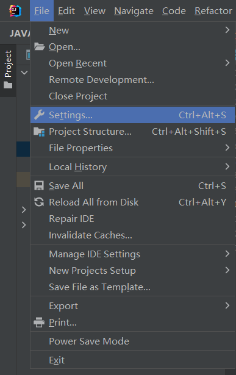
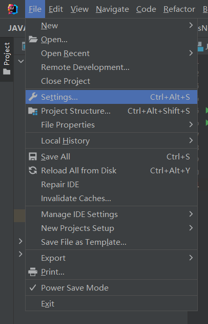

## 修改字体大小

`File`-->`Settings`



`Editor`-->`Font`-->`Size`-->`OK`


## 快捷操作

打出`阿拉伯数字小写.for`后回车，快速构建for循环

例：打出`10.for`后回车

```java
for (int i = 0; i < 10; i++) {
            
}
```


## 常用快捷键

| 快捷键           | 作用                       | 备注                 |
| ---------------- | -------------------------- | -------------------- |
| Ctrl + D         | 快速复制当前行到下一行     |                      |
| Ctrl + R         | 在当前打开的文件中替换     | 不同于常用的Ctrl + H |
| Ctrl + Shift + R | 在选定的目录下或类包下替换 | 未验证               |


## 更改主题

默认主题是Darcula，


`File`-->`Settings...`



展开`Appearance & Behavior`-->`Appearance`-->`Theme`


## 更改代码字体

### [常用RGB颜色表](http://www1.ynao.ac.cn/~jinhuahe/know_base/othertopics/computerissues/RGB_colortable.htm)

#### 注释

`File`-->`Settings...`


展开`Editor`-->展开颜色组合`Color Scheme`-->`Java`-->`IntelliJ Light`-->展开注释`Comments`-->多行注释`Block comment`-->取消从默认语言中继承格式，即取消勾选`Inherit values from`


左键单击1 --> 在2处输入`暗绿色`的RGB组合`48、128、20`-->回车


单行注释`Line comment`同理，设置更改完成后点`OK`保存。

# 下载

下载地址：https://www.jetbrains.com.cn/idea/download/#section=windows

我下载的是 `ideaIU-2022.1.1.exe` （备份在**IntelliJ IDEA**文件夹目录下）

双击 `ideaIU-2022.1.1.exe`

勾选创建关联 `.java`


# 启动

启动文件 `idea64.exe`

# 文件(F)

## 新建(N)

### 项目...

#### 新建项目


#### 空项目


### 新模块


## 设置(T)...

### 构建、执行、部署

#### 调试器

##### 步进

不要进入类

## 项目结构...

### 项目


# 帮助(H)

## 关于(A)

IntelliJ IDEA 2022.1.1

# 问题

## Missing essential plugin: com.intellij (platform prefix: null) please reinstall intellij idea

删除  `C:\Users\Administrator\AppData\Roaming\`  路径下的  `JetBrains `文件夹后，重新安装 `IntelliJ IDEA` 即可

注：\Users\Administrator 不同的电脑可能会有差异，找到后面的路径就行

## 错误: 找不到或无法加载主类

打开项目文件路径错误，必须在最顶层文件夹打开

## 如何同时更改类名和类文件名

选中需要更改的类 --> 右键 --> 重构(R) --> 重命名(R)


修改类名 --> 左键单击重构


## 调试时，无法进入 Integer 类中，查看更详细的过程

依次点击：

设置 -> 构建、执行、部署 -> 调试器 -> 步进

取消勾选 不要进入类


## 设置代理

文件 → 设置 → 外观与行为 → HTTP 代理 → 勾选 `自动检测代理设置`


